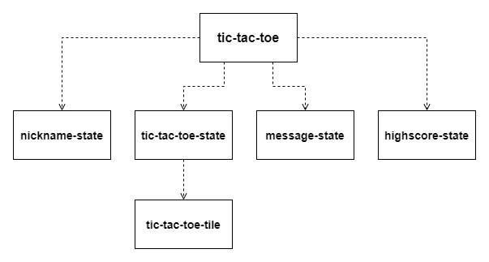
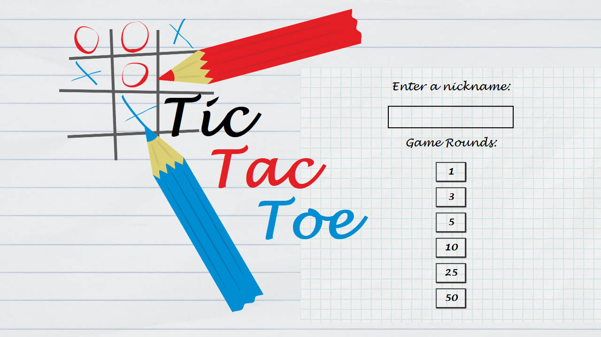
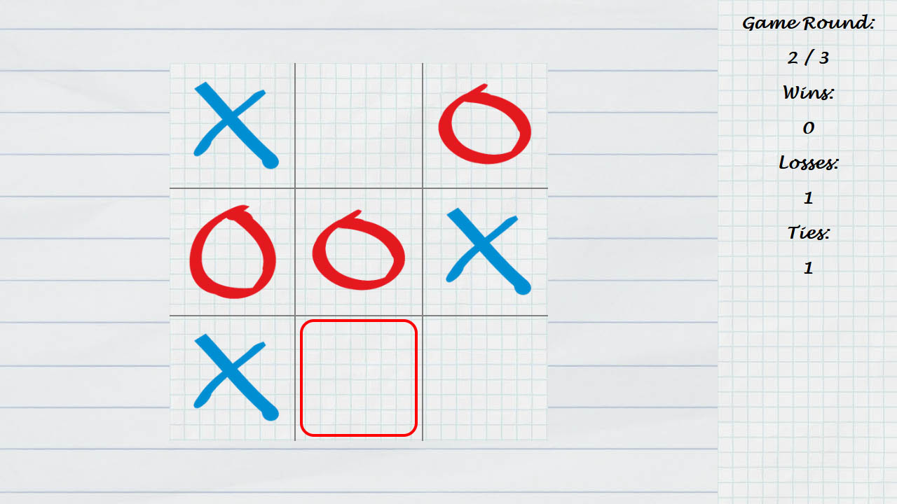
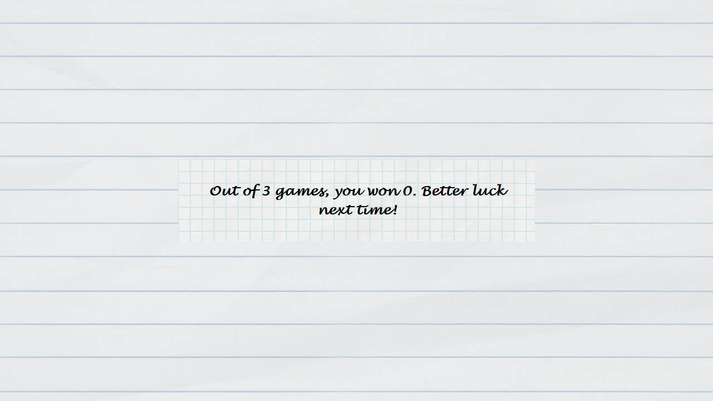
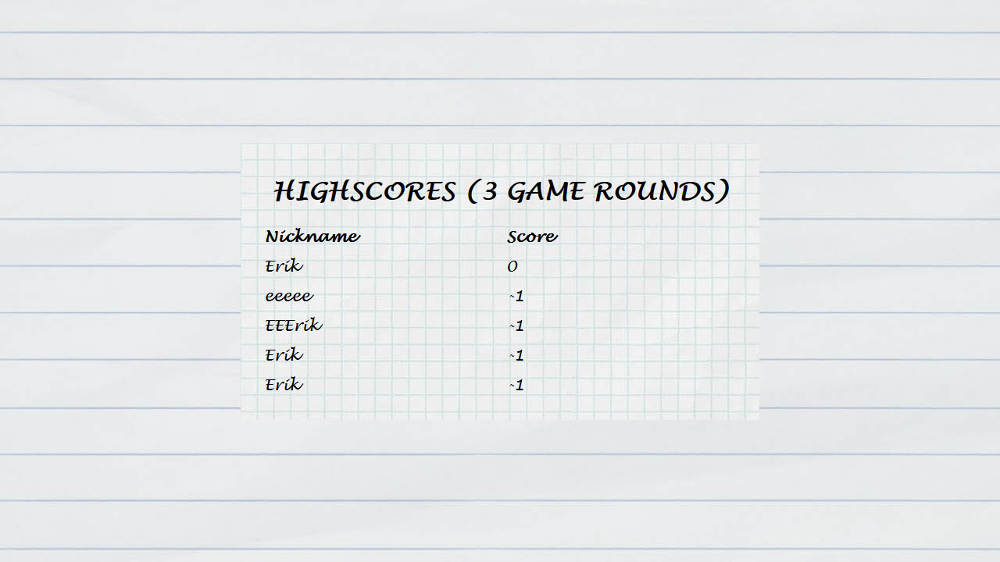

# Tic Tac Toe
This component is a single-page application Tic Tac Toe game. Features include multiple game modes, keyboard controls, and highscore lists stored locally (note that <b>highscores will be erased when clearing browser cache.</b>)

## Running the application
1. First, run the included .jar file to start the API, which will run on port 8080 by default. The API requires Java 1.8 and can be started by double-clicking the .jar file, or by using the command `java -jar tic-tac-toe-api-1.0.0.jar`.
2. Open the application folder in your code editor of choice and use the command `npm install`.
3. Use the command `npm start`. If questioned `Port 8080 not available. Run on port 8081 instead? (Y/n)`, answer `Y`.
4. The application should now start automatically in your web browser. You can also open the browser yourself and access it by typing `http://localhost:8081/` in the address field.

# System architecture
The Tic Tac Toe application consists of the following web components:

## tic-tac-toe
The main component, which can be inserted into an HTML file as a custom \<tic-tac-toe\> element. Works as a simple state machine - will immediately display nickname-state on startup, and then change between the different state components. 

### Public methods

#### `SetSize(width, height)`
Just like setting the `size` attribute, calling the `SetSize` method sets the width and height of the component. The `width` and `height` arguments should be in pixels.

### Attributes

#### `size`
Sets the width and height of the component, in pixels. The value should be a pair of numbers separated by a comma, as in "800,600" or "800, 600".

Default value: `1280, 720`

## nickname-state

Displays the title screen, where the user enters a nickname and chooses the amount of game rounds to play. The length of the nickname has to be at least three characters in order to proceed.

## tic-tac-toe-state

The in-game state, where the actual Tic Tac Toe game is played. A new state is instantiated on every new game round.

## message-state

Displays a message to the user after finishing all game rounds. Will only be displayed when playing three or more game rounds.

## highscore-state

Displays the highscores of the current game type. Will be displayed following the message-state when playing three or more game rounds. Highscores are saved by localStorage and will be erased when clearing the browser cache.

## tic-tac-toe-tile

A child component of tic-tac-toe-state. Represents a single box in the 3 x 3 grid of the Tic Tac Toe game.